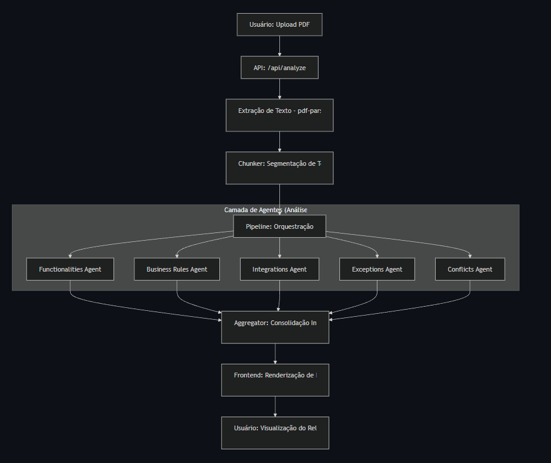
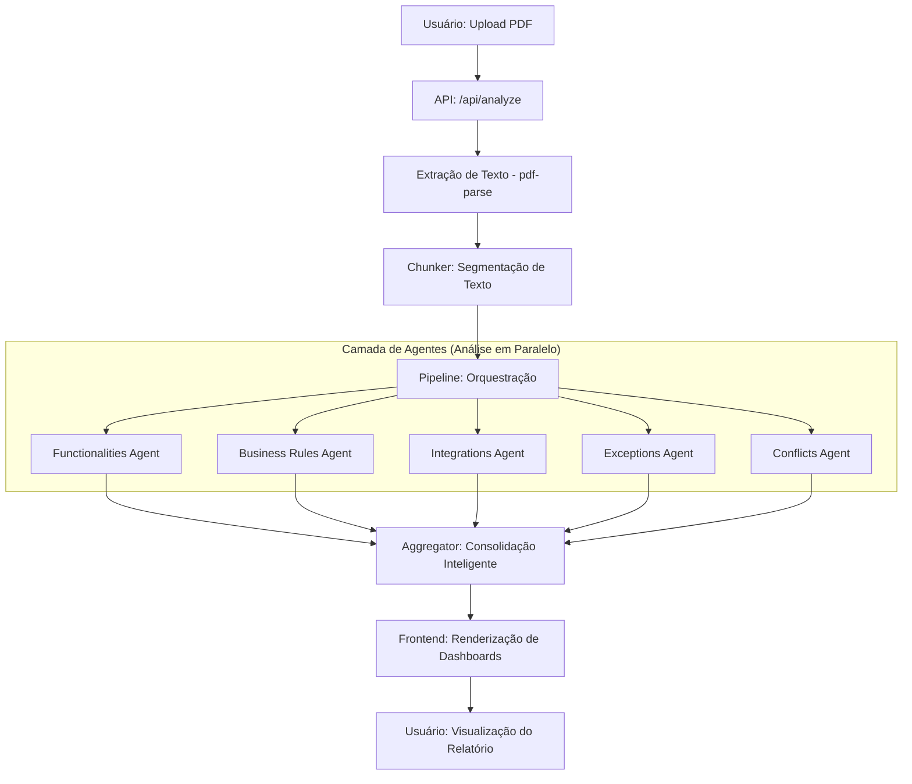

# 📄 Gemini Doc Analyzer

Uma aplicação Web inteligente construída com **Next.js 14+ (App Router)** que permite o envio de documentos de requisitos em formato PDF para realizar uma análise detalhada utilizando a API do **Gemini 2.5 Flash**. O sistema foca em performance, processando os documentos em memória, e fornece análises ricas e categorizadas sobre o conteúdo do documento.

## 🚀 Funcionalidades

- **Upload e Drag-and-drop:** Interface amigável para envio de arquivos PDF.
- **Processamento em Memória:** O arquivo PDF é processado no servidor (backend) sem ser salvo em disco, garantindo segurança e agilidade.
- **Integração com IA (Gemini 2.5 Flash):** Análise rápida e detalhada usando a mais recente tecnologia do Google Generative AI.
- **Extração Inteligente de Conteúdo:**
  - **📝 Resumo Executivo:** Visão geral do que o projeto ou documento aborda.
  - **✅ Funcionalidades:** Lista clara de todas as funcionalidades identificadas no escopo.
  - **⚠️ Falhas Lógicas:** Detecção estruturada de erros de lógica apresentados no documento, com análise de impacto e gravidade.
  - **🏢 Gaps de Negócio:** Mapeamento de regras de negócio faltantes ou ambíguas.
  - **🎨 Sugestões de UX:** Dicas de melhorias para a experiência do usuário baseadas nas regras apresentadas.
- **Exportação (Printable/PDF):** Resultados exibidos de forma otimizada e organizados em modais/cards limpos.

## 🛠️ Tecnologias Utilizadas

- **[Next.js 14+](https://nextjs.org/)** - Framework React com App Router
- **[TypeScript](https://www.typescriptlang.org/)** - Tipagem estática
- **[Tailwind CSS](https://tailwindcss.com/)** - Estilização utilitária
- **[Lucide React](https://lucide.dev/)** - Biblioteca de ícones
- **[Google Generative AI SDK](https://www.npmjs.com/package/@google/generative-ai)** - Integração com o modelo Gemini 1.5 Flash
- **[pdf-parse](https://www.npmjs.com/package/pdf-parse)** - Extração de texto de PDF no ambiente servidor
- **[jsPDF / jsPDF AutoTable](https://github.com/simonbengtsson/jsPDF-AutoTable)** - Para suporte opcional de exportação de PDF no lado cliente

## 🏗️ Arquitetura do Sistema

A aplicação utiliza uma arquitetura baseada em um **Pipeline de Multi-Agentes** para processar documentos complexos com alta precisão e especialização.

### 🧩 Componentes do Core

1.  **Chunker**: Responsável por segmentar o texto extraído do PDF em blocos gerenciáveis. Isso permite processar documentos extensos sem exceder limites de contexto e focar a análise em partes específicas do documento.
2.  **Pipeline Orchestrator**: Coordena a execução dos agentes. Ele gerencia o fluxo de dados entre os blocos de texto e os especialistas de IA, garantindo que cada parte do documento seja analisada sob múltiplas perspectivas.
3.  **Agentes Especialistas**: Cada agente é configurado com prompts específicos para atuar em domínios distintos:
    *   **Functionalities Agent**: Focado em identificar e descrever os requisitos funcionais.
    *   **Business Rules Agent**: Especialista em regras de negócio e identificação de lacunas (gaps).
    *   **Integrations Agent**: Mapeia dependências e comunicações com sistemas externos.
    *   **Exceptions Agent**: Identifica fluxos de erro, estados de borda e mensagens ausentes.
    *   **Conflicts Agent**: Detecta contradições lógicas e ambiguidades no texto.
4.  **Aggregator**: Atua como um "Arquiteto de Soluções Sênior", recebendo as descobertas parciais de todos os agentes e consolidando-as em um relatório final estruturado, eliminando duplicatas e gerando métricas de qualidade.

### 🔄 Fluxo de Execução (End-to-End)





## ⚙️ Pré-requisitos

Para rodar o projeto localmente, certifique-se de ter instalado:
- Node.js (versão 18.x ou superior recomendada)
- `npm`, `yarn` ou `pnpm`
- Uma chave de API válida do **Google Gemini** (Google AI Studio).

## 🏃‍♂️ Como Executar Localmente

**1. Clone o repositório ou acesse a pasta do projeto:**
```bash
cd gemini-analyzer
```

**2. Instale as dependências:**
```bash
npm install
# ou
yarn install
# ou
pnpm install
```

**3. Configure as Variáveis de Ambiente:**
Crie um arquivo `.env.local` na raiz do projeto e adicione a sua chave da API do Gemini:
```env
GOOGLE_GEMINI_API_KEY=sua_chave_de_api_aqui
```

**4. Inicie o servidor de desenvolvimento:**
```bash
npm run dev
# ou
yarn dev
# ou
pnpm dev
```

**5. Acesse a Aplicação:**
Abra [http://localhost:3000](http://localhost:3000) no seu navegador para utilizar a ferramenta.

## 📁 Estrutura do Projeto

- `src/app/page.tsx`: Interface principal da aplicação.
- `src/app/api/analyze/route.ts`: Entry point da API que orquestra o processo de análise.
- `src/lib/ai/`:
    - `pipeline.ts`: Orquestrador dos agentes de IA.
    - `chunker.ts`: Lógica de segmentação de documentos.
    - `aggregator.ts`: Consolidação inteligente de resultados múltiplos.
    - `agents/`: Implementação detalhada de cada especialista de análise.
- `src/components/`: Componentes React para exibição de resultados e UI.

## 💡 Princípios de Arquitetura

- **Especialização de Domínio**: Em vez de um único prompt genérico, utilizamos múltiplos agentes especialistas, cada um com uma instrução de sistema otimizada para identificar aspectos específicos do documento.
- **Processamento em Memória**: Segurança rigorosa – o PDF é processado inteiramente em memória no servidor, sem persistência em disco ou banco de dados.
- **Resiliência e Recuperação**: O sistema utiliza técnicas de retry e fallback no agregador JSON para garantir que falhas parciais de IA não interrompam a experiência do usuário.

---
*Projeto desenvolvido para análise inteligente de requisitos de software e auxílio para QAs e Analistas de Sistemas.*
